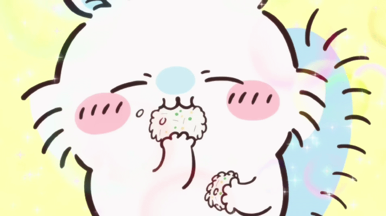

## 안녕하세요! 저는 Suna입니다 🙂

## :palm_tree:저의 코딩 토벌 여정에 오신 것을 환영합니다 :palm_tree:

### 오늘도 영차영차 열심히 알고리즘 토벌 중!! 💦 💦

## Skills 🚀

### Languages 💻

 
 

### Tools 💻

#### 목표: 알고리즘 토벌 열심히 해서! 코딩 랭킹 높이고 맛있는거 사먹기 ♥️

